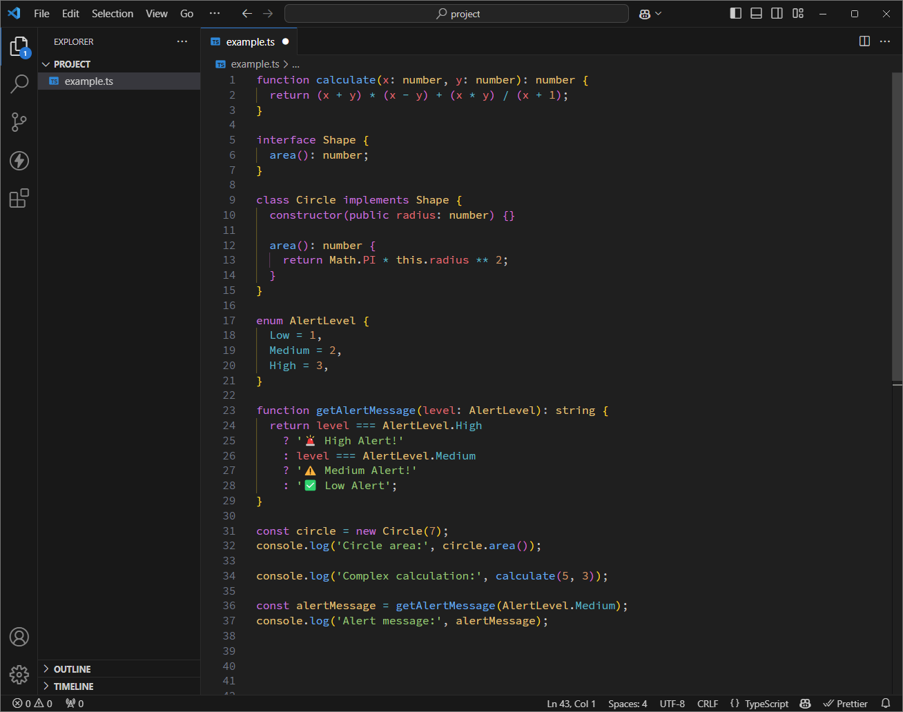

# [One Dark Modern Pro](https://marketplace.visualstudio.com/items?itemName=aleksa-codes.one-dark-modern-pro)

  

A custom theme based on **One Dark Pro** for syntax highlighting and **VS Code Dark Modern** for the user interface.

[GitHub Repo](https://github.com/aleksa-codes/one-dark-modern-pro)

## Preview

## Features

- **Syntax Highlighting**: Inspired by [One Dark Pro](https://marketplace.visualstudio.com/items?itemName=zhuangtongfa.Material-theme) theme, Darker variant.
- **UI Elements**: Based on VS Code's native **Dark Modern** theme.

## Recommendations

To enhance your coding experience, consider using the following:

- **Font**: [Source Code Pro](https://github.com/adobe-fonts/source-code-pro) – A clean, monospaced font designed specifically for developers.
- **Icons**: [Bearded Icons](https://marketplace.visualstudio.com/items?itemName=BeardedBear.beardedicons) – A modern and stylish icon set for Visual Studio Code.

## How to Switch to the Theme (If Not Applied Automatically)

If the theme doesn't switch automatically after installation, follow these steps:

1. Open **Command Palette** by pressing:
   - **`Ctrl+Shift+P`** on Windows/Linux
   - **`Cmd+Shift+P`** on macOS
2. Type **"Color Theme"** and select **"Preferences: Color Theme"**.
3. Scroll through the list and select **One Dark Modern Pro**.

Your theme should now be active, with One Dark Pro colors for syntax and the native VS Code Dark Modern UI elements.

## License

This theme is available under the [MIT License](LICENSE).
